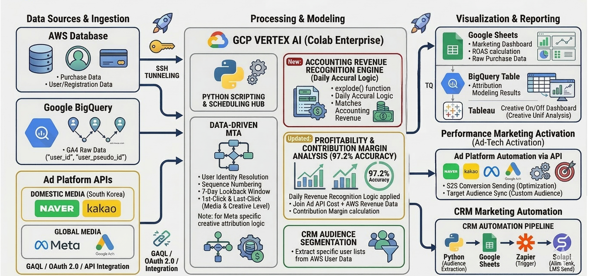

# 📊 파이브스팟 다채널 기여도 분석(MTA) 및 마케팅 자동화 파이프라인

패스트파이브 신사업 '파이브스팟'의 마케팅 ROI 최적화를 위해 멀티 클라우드(AWS RDS, GCP BigQuery) 데이터와 광고 매체 API를 통합한 **다채널 기여도 분석(MTA) 자동화 시스템**입니다. 

마케팅 성과 분석 및 전략적 의사결정 보고에 활용되며, 기존 Last-Click 방식의 성과 왜곡을 제거하고 유저 여정 내 터치포인트별 기여도를 정밀하게 추적합니다.

---

## 🚀 프로젝트 주요 과제

* **유입 채널 추적 누수 해결**: 분리되어 있던 DB 결제 데이터와 GA4 웹 행동 로그를 고유 식별자로 결합하여 마케팅 유입 경로의 사각지대 제거.
* **MTA 성과 측정 왜곡 극복**: 최종 전환 매체만 인정받는 Last-Click 분석의 한계를 극복하고, 최초 인지(First-Click) 및 중간 여정에 참여한 매체와 광고 소재의 가치를 정량적으로 평가.
* **CRM 및 리포트 공수 자동화**: 매체별 광고비 취합, MTA 기여도 연산, 타깃 고객 추출 및 알림톡 발송까지 이어지는 마케팅 업무 전 과정 자동화.

---

## 🏗️ 시스템 아키텍처

### 1. Data Ingestion (마케팅 데이터 수집)
* **AWS Database**: 인터넷이 차단된 보안망 내 RDS에서 `SSH 터널링` 기반으로 파이브스팟 결제 원장 및 유저 마스터 데이터 추출.
* **Google BigQuery**: 구글 태그 매니저(GTM)로 맞춤 수집된 고정밀 웹 행동 로그(GA4 Raw Data) 적재.
* **Ad Platform APIs**: 네이버, 카카오, Meta, Google Ads API 연동을 통해 매체별 광고 집행 비용 데이터 동기화.

### 2. Processing & Modeling (MTA 모델링 및 가공)
* **데이터 기반 MTA 모델링**: 7일 분석 기간(Lookback Window) 기준으로 고객 여정을 추적하여 First-Click(최초 인지), Last-Click(최종 전환), Linear(선형 배분) 기여도를 광고 소재(Creative) 레벨까지 연산.
* **정규표현식 매체 자동 매핑**: 파편화되어 유입되는 다양한 UTM 파라미터 데이터를 비즈니스 채널 유형(NaverSA, Meta/Instagram, CRM, Organic 등)으로 정밀하게 자동 분류하는 정규표현식(Regex) 로직 설계.
* **CRM 타깃 세그먼테이션**: MTA 분석 결과 특정 터치포인트를 거쳤거나 유저 여정 상 액션이 필요한 타깃 세그먼트 데이터 추출.

### 3. Activation & Reporting (최종 활용 및 CRM 자동화)
* **의사결정 BI 연동**: 빅쿼리 연산 결과를 구글 스프레드시트 및 `Tableau` 대시보드로 연동하여 매체·소재별 성과 보고 및 가시화 환경 마련.
* **CRM 마케팅 자동화 파이프라인**: 추출된 타깃 데이터를 `Python ➡️ Google Sheets ➡️ Zapier` 허브를 거쳐 `Solapi(솔라피)` API로 전달하여 타깃 맞춤형 알림톡 자동 발송 시스템 구축.

---

## 🚀 비즈니스 임팩트 및 성과

* **MTA 모델 기반 예산 효율 최적화**: 멀티 터치 기여도 분석을 통해 신규 유입 및 브랜드 인지에 기여한 숨은 매체와 크리에이티브 소재를 재발굴하여 광고 효율 극대화.
* **의사결정 데이터 신뢰도 확보**: 파편화된 행동 로그와 결제 데이터를 단일 데이터 마트(SSOT)로 통합하여 성과 보고 및 캠페인 전략 수립 시 마케팅 데이터 신뢰도 강화.
* **운영 공수 제로화**: 데이터 추출, 매체 매핑, MTA 가중치 계산, 시각화, CRM 발송까지 이어지는 수동 업무를 100% 자동화하여 리소스 절감.

---

## 💻 저장소 구조

* `marketing-mta-pipeline/`: 데이터 수집, 정규표현식 기반 매체 자동 매핑, First/Last/Linear MTA 기여도 가중치 산출 및 마트 적재를 수행하는 메인 파이프라인 소스코드 폴더.
* `data-pipeline.jpg`: 데이터 수집부터 기여도 연산, BI 시각화 및 CRM 마케팅 자동화 발송까지의 마케팅 데이터 흐름을 도식화한 아키텍처 장표.
