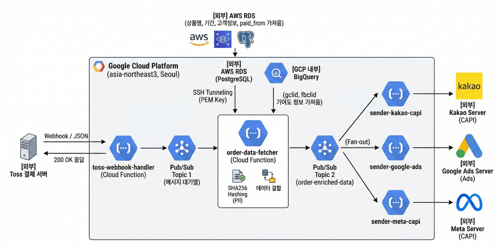

# 📡 서버 간 데이터 연동(CAPI)을 통한 광고 최적화 시스템 고도화

본 프로젝트는 결제 발생 시 실시간으로 구매 데이터를 수집하고, 데이터베이스(AWS RDS) 및 로그 저장소(GCP BigQuery)에 흩어진 유저 식별 정보와 결합하여 주요 광고 매체(Meta, Google, Kakao) 서버로 고정밀 결제 신호를 직접 전송하는 **안정적인 비동기 트래킹 파이프라인 구축 프로젝트**입니다.

브라우저 쿠키 제한 환경을 우회하는 서버 간 직접 연동 방식을 고도화하여, Meta 광고 관리자 기준 **구매 이벤트 매칭 품질(EMQ) 점수를 기존 5.6점에서 현재 8.1점(우수)까지 돌파**시켰으며 광고 최적화 효율을 극대화했습니다.

---

## 🚀 프로젝트 주요 과제

* **웹 트래킹 유실 방어 (쿠키리스 대응)**: 브라우저 쿠키 제한 및 광고 차단 프로그램(Ad-Block)으로 인해 광고 매체 픽셀에서 결제 데이터가 누수되는 현상 방지.
* **매체 매칭 품질(EMQ) 향상**: 단순 결제 신호만 보내는 것이 아니라 해시 처리된 유저 정보와 광고 클릭 식별자(`gclid`, `fbclid`)를 정밀하게 결합하여 매체의 타겟팅 최적화 효율 극대화.
* **시스템 부하 분산 및 안정성 확보**: 외부 결제 알림(Toss 웹훅) 수신 즉시 대기 없이 응답을 처리하고, 무거운 데이터 조회 및 매체 발송 로직은 뒷단에서 비동기로 안전하게 처리하여 결제 서버 부하 방지.

---

## 🏗️ 시스템 구조도

1. **결제 데이터 수신**: 토스 결제 서버로부터 결제 완료 이벤트를 수신(`Cloud Function`)하는 즉시 외부 채널에 성공 응답을 반환하여 시스템 타임아웃 방지.
2. **비동기 큐 누적**: 수신된 원본 데이터를 메시지 큐(`GCP Pub/Sub`)에 즉시 적재하여 안전한 데이터 버퍼 단계 구축.
3. **실시간 유저 데이터 결합 (핵심 로직)**: 큐에 쌓인 메시지를 소비하며 다중 소스 데이터 결합 수행.
   * **AWS RDS (PostgreSQL)**: 보안 터널링을 통해 결제 유저의 상품명, 이용 기간, 고객 정보 로드.
   * **GCP BigQuery**: 결제 유저의 GA4 광고 클릭 식별자(`gclid`, `fbclid`) 매칭 및 기여 정보 결합.
4. **개인정보 보안 암호화**: 고객식별정보(PII)를 매체별 가이드라인에 맞추어 `SHA256` 방식으로 단방향 암호화하여 개인정보보호 컴포넌트 준수.
5. **다중 매체 발송**: 가공이 완료된 고정밀 주문 데이터를 기반으로 Meta, Google, Kakao 등 각 매체별 전송 모듈을 통해 독립적으로 동시 발송.

---

## 💡 프로젝트 주요 성과 및 강점

### 1. Meta 구매 이벤트 매칭 품질 (EMQ) 8.1점 달성
* 유저 식별 파라미터 매핑 기법을 정교하게 다듬어, Meta 이벤트 관리자 기준 **구매(Purchase) 이벤트의 매칭 품질 점수를 기존 5.6점에서 8.1점(우수)까지 상향**시켰습니다.
* 현재 데이터 누적 트렌드에 따라 실시간으로 모수가 최적화되고 있으며, 매체 머신러닝이 진성 결제 유저 세그먼트를 더 정확히 학습할 수 있는 기반을 마련했습니다.

### 2. 새로운 매체 추가가 유연한 구조 설계
* 메시지 큐 기반의 독립 발송 구조를 채택하여, 향후 틱톡이나 트위터 등 **새로운 광고 매체가 추가되더라도 기존의 결제 수신 및 데이터 결합 코드를 전혀 건드리지 않고**, 새 매체의 전송 코드만 독립적으로 추가 배포하면 되는 뛰어난 확장성을 확보했습니다.

### 3. 멀티 클라우드 데이터 실시간 결합
* 실시간 결제 알림으로 들어오는 파편화된 데이터에 AWS의 구매 원장 데이터와 GCP의 행동 로그(광고 기여 식별값) 데이터를 밀리초(ms) 단위로 실시간 조인하여 마케팅 데이터 마트의 가치를 극대화했습니다.

---

## 💻 저장소 구조

* `order-data-fetcher/`: **[핵심 컴포넌트]** 비동기 큐를 소비하여 멀티 클라우드 데이터 결합 및 보안 해싱을 수행하는 메인 프로세서 엔진 소스코드.
* `live-meta-emq-score.png`: 구매 이벤트 매칭 품질 점수 8.1점(우수) 달성 및 우상향 트렌드를 증명하는 Meta 이벤트 관리자 라이브 대시보드 스크린샷.
