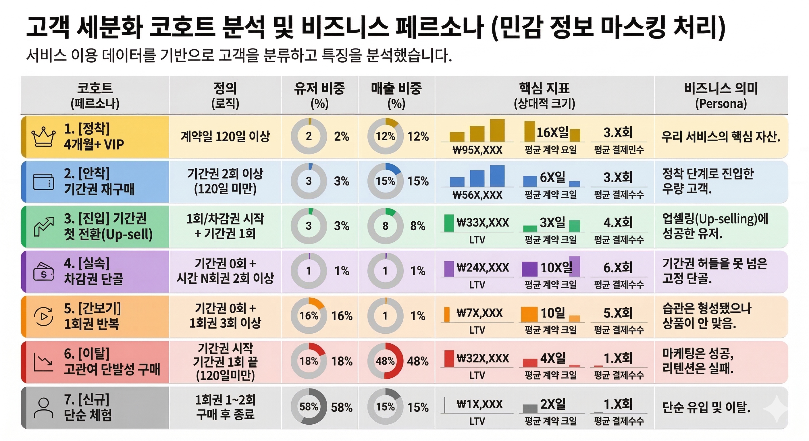

# 📊 Data-Driven Customer Cohort & Repurchase Behavior Analysis

본 프로젝트는 사내 결제 및 공간 이용(Check-in) 로그를 결합하여 고객의 리텐션(Retention) 패턴을 파악하고, 비즈니스 규칙에 따라 고객군을 정의하여 마케팅 전략을 도출한 **데이터 분석 및 CRM 세그먼테이션 프로젝트**입니다. 

회사의 대대적인 상품 및 서비스 개편일(2025-06-11)을 기점으로 유입된 순수 신규 유저들의 생애 이력을 정밀 추적했습니다.

## 🚀 Key Business Challenges

* **모호한 VIP 기준 정립**: 단순히 결제 금액이나 횟수가 아닌, 실질적 락인(Lock-in)을 증명하는 누적 이용 기간 마일스톤(120일) 수립 및 검증.
* **서비스 개편 성과 측정**: 기존 마이그레이션 유저와 개편 이후 유입된 순수 신규 유저(Pure New) 간의 잔존율 및 LTV 추이 비교 분석.
* **업셀링(Up-sell) 징검다리 상품 발굴**: 일회성 체험 고객(시간권/1일권)을 고관여 기간권(구독형)으로 전환시키는 데 가장 효과적인 크로스셀링 경로 파악.
* **공간 이용 데이터 연동**: 결제 데이터에 입실(Check-in) 로그를 결합하여 세그먼트별 하드웨어 이용 밀도 및 공간 소비 패턴 규명.

## 🎯 사전 가설 설정 및 분석 프레임워크 (Analytical Hypotheses)

단순한 데이터 조회를 넘어, 비즈니스 성장을 견인할 수 있는 5가지 핵심 가설을 사전에 수립하고 공간 로그 데이터를 통해 검증을 수행했습니다.

* **지점 확장성 (Branch Scalability)**: 이용하는 지점의 수가 많을수록 서비스 결합도가 높아져 재구매율이 상승할 것이다. (➡️ **검증 완료**: 고관여 그룹일수록 복수 지점 이용률 및 공간 이동 자유도 급증)
* **방문 밀도 (Usage Density)**: 계약 기간 내 방문 횟수가 조밀할수록(고밀도 이용) 상위 상품으로 전환하거나 재구매할 확률이 높을 것이다. (➡️ **검증 완료**: 안착/진입 코호트의 방문 밀도가 타 집단 대비 최대 2배 이상 높음)
* **이용 시간대 (Peak-Time Discoupling)**: 특정 피크 타임 이용 비중과 재구매 상품군 사이에 유의미한 상관관계가 존재할 것이다. (➡️ **검증 완료**: 오피스 대체형 VIP 집단과 단발성 체험 집단의 입실 피크타임 디커플링 확인)
* **지리적 거점 (Geographic Lock-in)**: 특정 권역(예: 강남/판교) 내 지점들을 교차 이용하는 유저는 지리적 락인 효과가 강할 것이다. (➡️ **검증 완료**: 세그먼트별 거점 오피스 이용 편중 현상 데이터 전수 검증)
* **첫 구매 상품 (Front-End Catalyst)**: 최초 구매 상품의 유형(1회권 스타트 vs 기간권 스타트)이 유저의 전체 생애가치(LTV)를 결정하는 선행 지표가 될 것이다. (➡️ **검증 완료**: 첫 터치포인트가 차감권일 때 대량 구독 코호트로의 업셀링 확률 2배 증가)

## 🛠️ Customer Cohort Segmentation Matrix

유저들의 생애 첫 결제 상품 종류, 구매 횟수, 그리고 기간권 누적 이용 일수를 유기적으로 조합하여 정의한 7가지 독자적인 코호트 스키마(Schema)입니다.

| 코호트 세그먼트 명칭 | 분류 기준 (Business Logic) | 비즈니스 의미 |
| :--- | :--- | :--- |
| **1. [정착] 4개월+ VIP** | 기간권(무제한/주야) 합산 이용 일수 $\ge$ 120일 | 서비스에 완전히 정착한 핵심 고가치 고객 |
| **2. [안착] 기간권 재구매** | 기간권 구매 횟수 $\ge$ 2회 (누적 120일 미만) | 정착 단계로 진입 중인 고관여 반복 구매 유저 |
| **3. [진입] 기간권 첫 전환** | 첫 구매는 체험권(시간/차감) $\rightarrow$ 이후 기간권 1회 업셀 | trial 체험 후 기간권으로 성공적으로 유치된 유저 |
| **4. [실속] 차감권 단골** | 기간권 0회 & 차감권(N회) 구매 2회 이상 | 정기 구독은 부담스러우나 실속형으로 자주 찾는 유저 |
| **5. [간보기] 1회권 반복** | 기간권 0회 & 시간/1회권 구매 3회 이상 | 매번 필요할 때만 단발성으로 결제하는 고비용 유저 |
| **6. [이탈] 고관여 단발성** | 기간권 딱 1회 혹은 차감권 딱 1회 구매 후 종료 | 초기 관여도는 높았으나 재구매로 유도 실패한 집단 |
| **7. [신규] 단순 체험** | 첫 구매 상품이 시간/1회권이며 생애 결제 2회 이하 | 서비스 탐색 단계에 머물러 있는 잠재 고객군 |

### 📊 코호트별 가치 지표 및 매출 기여도 분석 결과

상기 분류 기준을 토대로 2025년 하반기 신규 유입 고객 데이터를 매핑하여 도출한 세그먼트별 핵심 성과 지표(KPI) 리포트입니다.

## 💡 Key Analytical Insights

### 1. 재구매 골든타임과 이탈 임계점 (Churn Point) 발견
* 재구매 고객의 **80%는 이용 종료 후 15일 이내(Golden Time)** 복귀하며, 90%는 35일 이내에 돌아옵니다.
* 서비스 종료 후 **63일(Danger Zone)**이 넘어가는 순간 복귀 확률은 5% 미만으로 급감합니다. 6개월(180일) 이후 돌아오는 '기적의 복귀자'는 전체의 0.2%에 불과하므로, 종료 후 14일 이내의 집중 타겟팅 CRM 시나리오가 필수적임을 증명했습니다.

### 2. 크로스셀링 징검다리 상품의 효율 검증
* 단순 '시간/1회권'을 경험한 유저의 기간권 업셀링 전환율은 **2.20%**인 반면, '차감권(N회권)'을 첫 상품으로 경험한 유저의 전환 효율은 **4.33%**로 약 2배 높았습니다. 
* 신규 유저 유입 마케팅 시 1회권 할인보다 차감권 패키지를 유도하는 것이 장기 고관여 유저(3번 코호트) 확보에 훨씬 유리하다는 팩트 기반의 마케팅 방향성을 제시했습니다.

### 3. 세그먼트별 공간 이용 패턴과 방문 밀도 분화
* **방문 밀도(총 입실 횟수 / 총 계약일)** 분석 결과, 2번 코호트(안착 집단)가 58.4%로 가장 높았으며 1번 VIP 집단은 45.5% 수준을 유지했습니다.
* **출근 시간대 피크타임** 분석 시 고관여 코호트(1, 2, 3번)는 오전 9시~10시에 입실이 집중되는 '오피스 대체형' 패턴을 보인 반면, 단순 체험권 유저들은 오후 1시~2시에 집중되는 '카공족/유동형' 패턴을 보이며 세그먼트별 공간 소비 목적이 전혀 다름을 도출했습니다.

## 📍 코호트별 오프라인 공간 소비 패턴 (Region & Branch Preferences)

공간 하드웨어 서비스(공유오피스) 매체 특성에 맞추어 각 고객 코호트 세그먼트가 실제로 가장 활발하게 소비하는 **선호 지역(Region) 및 거점 지점(Branch) Top 3**를 도출하여 공간 운영 및 지역 타겟팅 마케팅의 구체적 근거를 마련했습니다.

* **1. [정착] 4개월+ VIP (도심 거점 안착형)**
  * **선호 권역**: 서울 강남구 (26.1%) ➡️ 서울 중구 (10.9%) ➡️ 서울 용산구 (9.4%)
  * **인기 지점**: 파이브스팟 시청2호점 (7.6%), 파이브스팟 판교1호점 (7.6%), 파이브스팟 반포1호점 (5.7%)
* **2. [안착] 기간권 재구매 (강남/서초 중심형)**
  * **선호 권역**: 서울 강남구 (24.4%) ➡️ 서울 서초구 (11.5%) ➡️ 서울 성동구 (10.3%)
  * **인기 지점**: 파이브스팟 반포1호점 (9.0%), 파이브스팟 합정1호점 (6.5%), 파이브스팟 서울숲1호점 (6.2%)
* **3. [진입] 기간권 첫 전환 (용산/판교 랜드마크형)**
  * **선호 권역**: 서울 강남구 (23.2%) ➡️ 서울 용산구 (20.7%) ➡️ 경기 성남시 (8.3%)
  * **인기 지점**: 파이브스팟 서울역1호점 (9.9%), 파이브스팟 판교1호점 (7.9%), 파이브스팟 용산1호점 (6.2%)
* **6. [이탈] 고관여 단발성 구매 (단발성 인프라 체험형)**
  * **선호 권역**: 서울 강남구 (25.3%) ➡️ 서울 용산구 (9.1%) ➡️ 서울 성동구 (8.2%)
  * **인기 지점**: 파이브스팟 판교1호점 (5.6%), 파이브스팟 사당1호점 (4.1%), 파이브스팟 여의도1호점 (3.8%)
* **7. [신규] 단순 체험 (엔트리 핫플레이스형)**
  * **선호 권역**: 서울 강남구 (25.9%) ➡️ 서울 마포구 (10.9%) ➡️ 서울 용산구 (10.4%)
  * **인기 지점**: 파이브스팟 판교1호점 (7.5%), 파이브스팟 합정1호점 (7.4%), 파이브스팟 용산1호점 (4.4%)

## 💻 Repository Structure

* `repurchase-cohort-analysis.ipynb`: 데이터 추출(SQL), 전처리 및 클렌징, 코호트 스코어링 알고리즘, 리텐션 매트릭스 구현이 포함된 메인 분석 노트북 파일.
