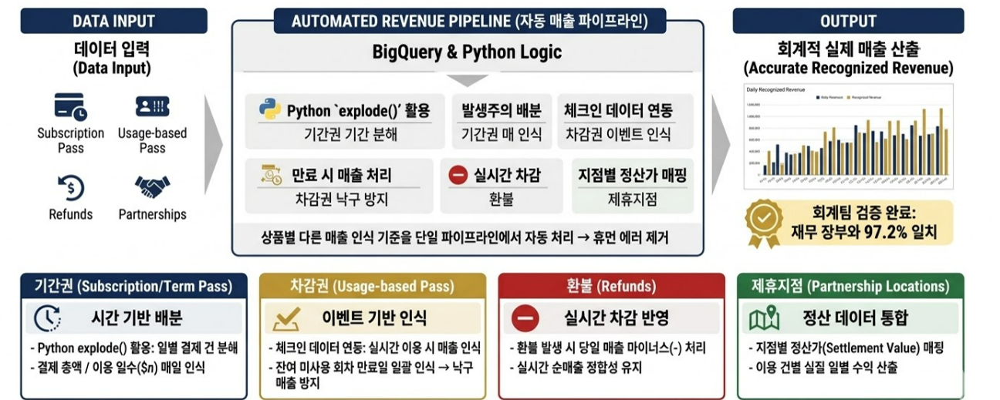

# 📂 Accounting & Revenue Recognition Automation Pipeline

본 프로젝트는 AWS 환경의 프로덕션 데이터베이스(RDS)와 GCP 인프라, 그리고 Google Workspace API를 결합하여 **Cross-Cloud 환경에서 기업의 회계/재무 실적 마트를 완전 자동화한 매출 정산 엔지니어링 프로젝트**입니다.

정기 구독형 기간권, 패키지형 차감권, 제휴 지점 정산 등 비즈니스 모델 다각화로 인해 수작업으로 마감하던 회계적 매출 인식(Revenue Recognition) 프로세스를 무결성 파이프라인으로 구축했습니다.

## 🏗️ System Architecture

## 🎯 Engineering Challenges & Core Solutions

* **Cross-Cloud 보안 정합성 확보 (AWS to GCP)**
  * AWS RDS 인프라에 접근하기 위해 GCP 환경에서 `SSHTunnelForwarder`를 경유하는 보안 터널링을 구축했습니다.
  * 컨테이너/서버리스 환경에서 발생할 수 있는 로컬 디스크 보안 취약점을 방어하기 위해, GCS(Google Cloud Storage) 내에 은닉된 인증 키(`PEM`)를 로컬에 다운로드하지 않고 `gcsfs`와 `io.StringIO` 버퍼를 활용해 **메모리 상에서 실시간 스트리밍으로 RSAKey 인스턴스를 인젝션**하는 방어적 아키텍처를 구현했습니다.

* **회계적 매출 인식 규칙의 자동화 (Revenue Recognition Logic)**
  * 단단한 선결제 매출(U_sales)뿐만 아니라, 미사용 상태로 유효기간이 만료되어 소멸되는 **소멸 매출(Expired Revenue)**, 고객이 실제 공간을 이용한 시점에 차감되는 **인식 매출(Usage Revenue)**을 분리하여 일별 데이터 마트를 결정론적으로 적재하도록 설계했습니다.

* **B2B 제휴 지점 정산 투명성 확보**
  * 자체 직영 지점 외에 외부 공간 자산을 믹스한 제휴 지점(`branch.sub_type`)의 이용 로그를 전수 추적 및 분류하여, 정산 정합성을 100% 보장하는 자동화 정산 테이블을 구축했습니다.

## 📊 Financial Data Mart Schema

파이프라인을 거쳐 정제된 데이터는 비즈니스 마감 규격에 맞춰 총 5개의 타깃 테이블로 분화되어 실시간 적재(Overwrite)됩니다.

| 적재 대상 워크시트 | 파이프라인 베이스 컬럼 | 회계/재무적 비즈니스 정의 |
| :--- | :--- | :--- |
| **1. U_sales** | `payment_history.requested_at` | 결제 승인 완료 시점 기준의 당일 일반 결제 매출액 |
| **2. U_sales_차감형만료** | `contract.actual_end_date` | 패키지 차감권의 유효기간 만료에 따른 소멸 매출액 |
| **3. U_sales_차감형** | `check_in_history.check_in_date` | 차감권 유저가 실제 공간 입실 시 차감 인식되는 매출액 |
| **4. U_refund** | `refund_history.r_date` | 당일 발생한 계약 해지 및 부분 환불 차감액 |
| **5. df_제휴지점_사용** | `branch.sub_type = 'PARTNER'` | 외부 제휴 오피스 이용 유저 수 및 정산 대상 기초 통계 |

## 🛠️ Tech Stack & Key Implementations

* **Data Storage & Ingestion**: AWS RDS (PostgreSQL), Google Cloud Storage, `psycopg2`, `sshtunnel`
* **Data Processing & Transformation**: Python, Pandas, `paramiko` (In-Memory PKey Buffer Processing)
* **Downstream Integration**: Google Sheets API, `gspread` (Idempotent Overwrite Pattern)

## 💻 Repository Structure

* `accounting-revenue-automation.ipynb`: GCS 보안 인증부터 회계 인식 쿼리 구동, gspread API 기반 최신 자동 적재 자동화 소스코드가 포함된 메인 실행 파일.
